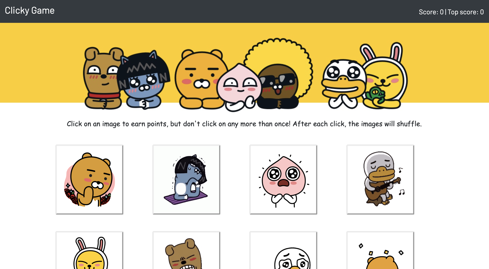

# Clicky Game
This is a memory game with React.js. 

## Getting Started
Click <a href="https://skang91.github.io/Clicky-Game/">here</a> to start!

## Screen Shots

## Instrcution
* The user begins the game by clicking on a gif.
* After each click, your score will change. The user's score will be incremented when clicking an image for the first time. The user's score will be reset to 0 if the user click the same image more than once.
* Every time an gif clicked, the gif will shuffle the cards themselves in a random order.
* Upon game end, the app will update your highest score and reset the current score.

## Technologies used
* React JS
* NPM Shuffle-Array
